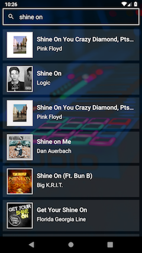
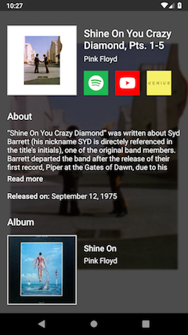

# Canor

Canor uses [Genius API](https://genius.com/developers) to fetch song and artist information. 
It allows you to search for a song and lets you view the song details and artist details.





The app is built using **MVVM architecture** and uses ViewModel and some other libraries from [android jetpack](https://developer.android.com/jetpack).

Libraries used in this project -

- [Dagger 2](https://github.com/google/dagger)
- [Retrofit 2](https://square.github.io/retrofit/)
- [Glide](https://github.com/bumptech/glide)
- [ButterKnife](https://github.com/JakeWharton/butterknife)
- [LiveData](https://developer.android.com/topic/libraries/architecture/livedata)
- [Navigation Components](https://developer.android.com/guide/navigation/)

#### Build Instructions
Create [your own API key](https://genius.com/api-clients/new) . Place your API key at 
```java
com.k2.musicdb.common.Constants.Genius.AUTH_TOKEN_VALUE
```
Build and run as usual 

#### Future/TODO
- Add search suggestions
- Better animations/transitions
- UI improvements